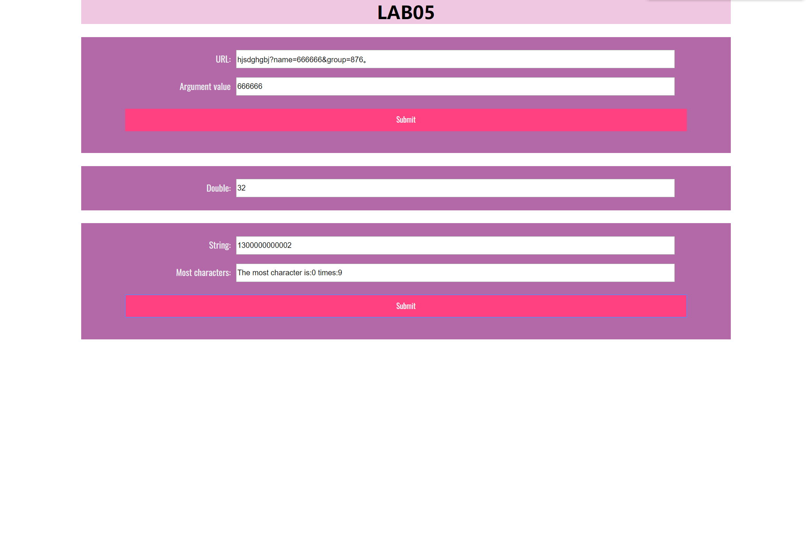
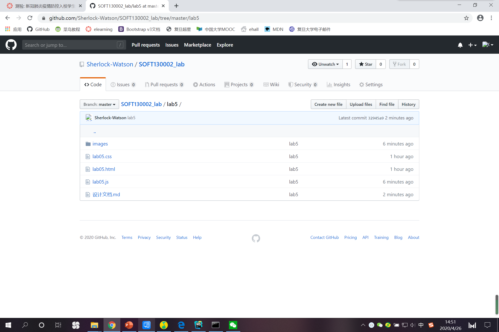

# Lab5设计文档

### 问题及解决
#### Mission 1
只支持正确的URL格式（这意味着假如输错了可能会报错，假如其中没有name，会输出no name。

#### Mission 2
在函数中内置了是否停止的判断，假如这一次输出时是在某分的0-4s，则终止`setInterval`的执行。

#### Mission 3
使用多个数组存放不同内容，str存放输入的字符串，count存放str第i位字符出现的频次，（i位该字符第一次出现的位置），比较字符出现的多少时得到的除了频次还有字符的位置index，这样就能用`str[index]`来表示出现最多次数的字符了。

#### 网页成果截图

#### github界面截图
