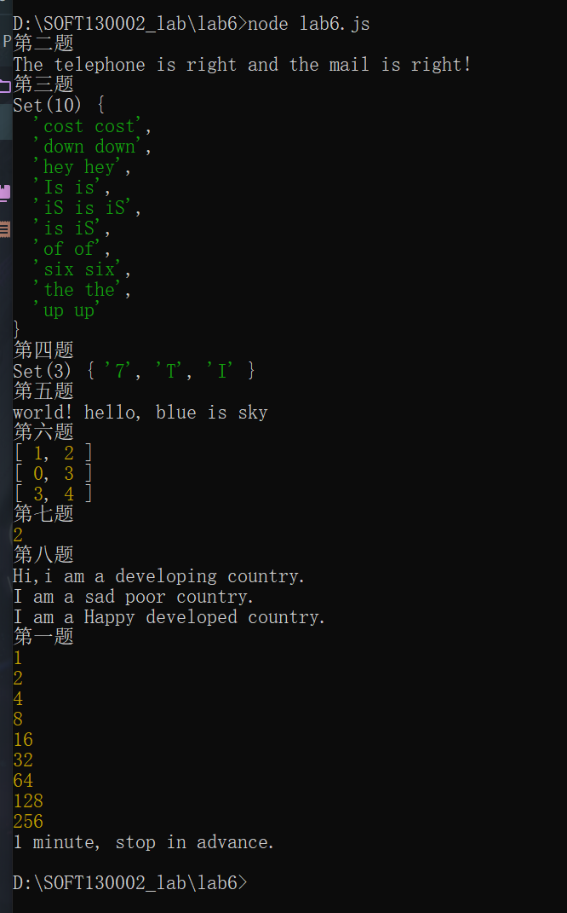
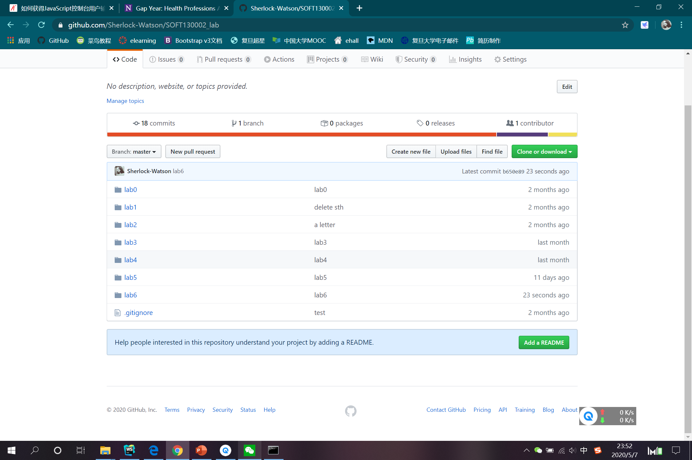

# Lab6设计文档

### 1.各个正则表达式的解释
```regexp
/^[1]([3-9])[0-9]{9}$/
```
电话号码的正则表达式，以1开头，第二位是3-9的数字，接下来还有9位0-9的数字，一共11位。
```regexp
/^([A-Za-z0-9_\-.])+@([A-Za-z0-9_\-.])+\.([A-Za-z]{2,4})$/
```
电子邮箱的正则表达式，以若干个大小写字母，数字，下划线，连接线，斜杠和点开头，中间有`@`字符，有若干个`.`字符将数个大小写字母组成的段落隔开。
```javascript
let pattern = new RegExp("^" + words[i] + "$", "i");
```
`words[i]`是输入语句中的第`i`个单词。这里正则表达式是通过`new`关键字创建的，构造函数接受两个参数，一个是字面量字符串，由`word[i]`组成，为了防止目标字符串仅仅是含有`word[i]`，我在前面和后面加入了`^`和`$`匹配目标字符串的开头和结尾，并且设成大小写不敏感，以便后续的判断。

还有几处是利用正则表达式将字符串切割成数组。如：
```javascript
let str;
let words = str.split(/ /g);
```

### 2.继承不同方式的理解
#### 2.1 构造函数
通过在子类构造函数第一行调用父类构造函数来实现。和Java中的实现类似。

#### 2.2 原型链
通过将子类的原型设为父类的实例来实现。

#### 2.3 Object.create()
通过对父类实例的浅复制实现，直接产生子类实例。所有副本会共享父类实例中引用类型变量的值。

### 3.Map、Set、Array之间的区别和使用
#### 3.1 Map
是有序键值对序列。但是数组（一维）或者对象转成`Map`类型必须要通过循环，有点麻烦，`Map`可以通过`map.entries()`方法方便地转成数组的数组。但是对键值对的查找比较方便。（第6题在注释掉的代码中，我仅用`Array`实现了功能，但是要长不少）。

#### 3.2 Set
是有序的类数组对象，可以进行数组的无重复合并，可以轻松计算有重复元素的数组的元素种类数，可以由一维数组轻松转成。

#### 3.3 Array
是比较普通的数组，本质是对象，下标的本质是属性名称，每个元素的本质是相应下标属性中存储的值，可以轻松地通过改变长度删去最后的元素，这是前两个类型所做不到的。但是`Array`类型无法查重，也难以查找，虽然有很多方法，操作也比较方便，但是最好能转成前两个类型进行使用，会更加方便。

#### 运行结果截图


#### github提交截图
