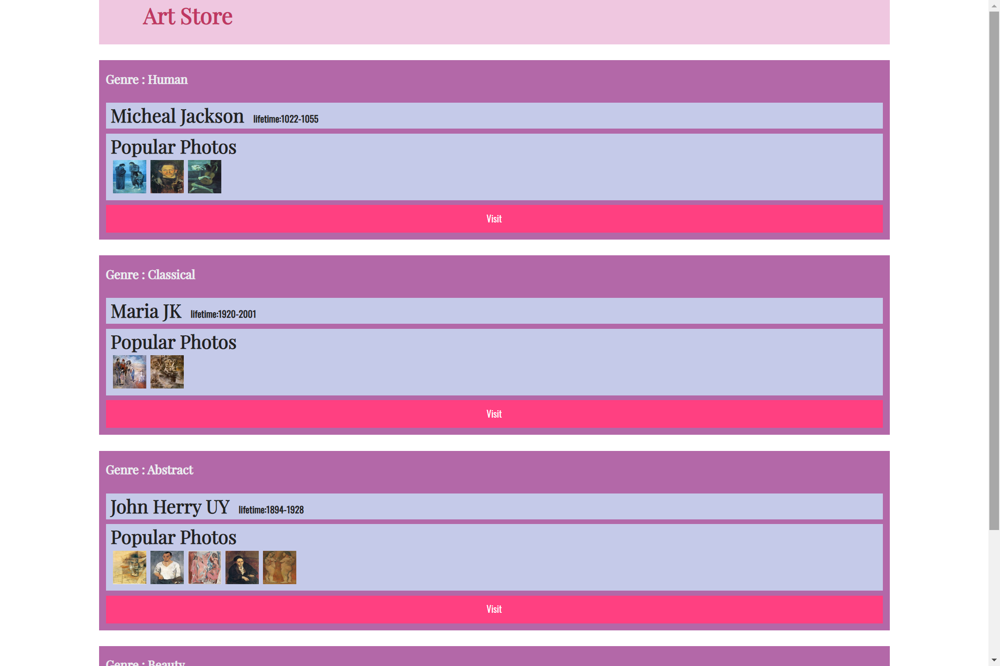
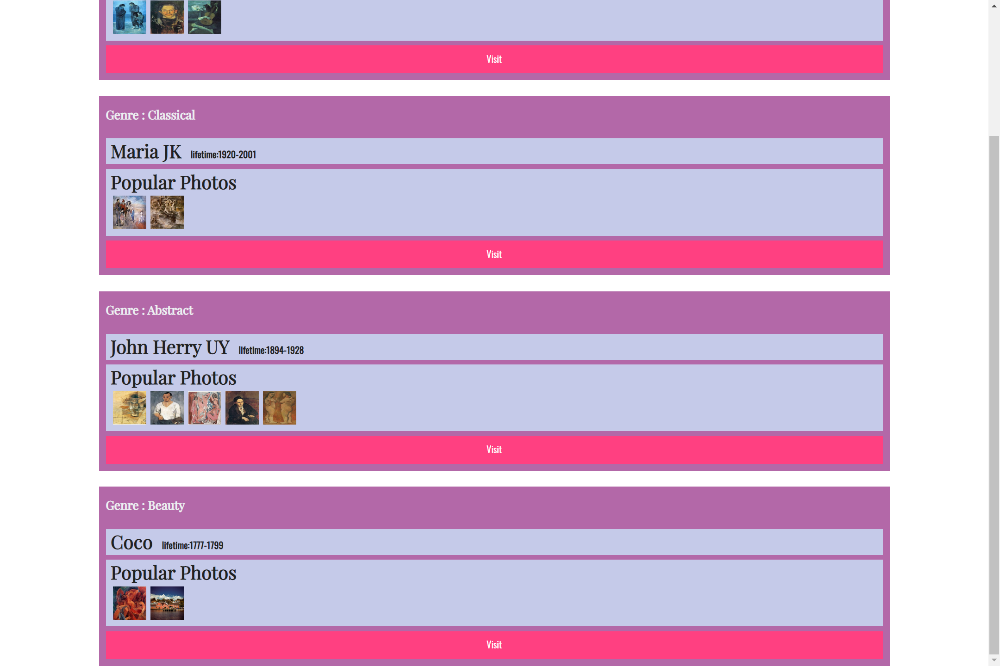
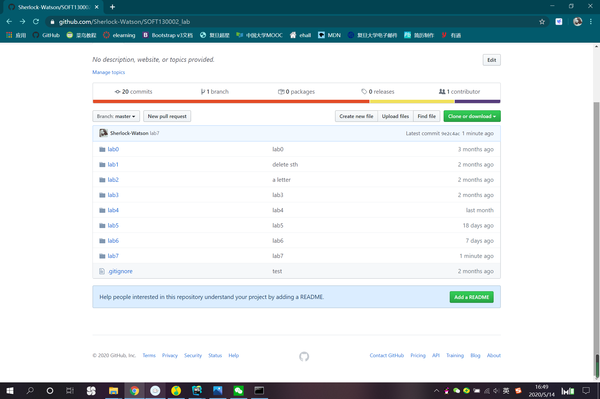

# Lab7设计文档
### 1.写在前面
lab07.css文件中有如下代码：
```css
.item div img:hover{
    border-color: lightblue;
}
```
这里虽然提示了我``元素是被`<div>`元素所包裹的，但是大括号里的内容没有任何用处，因为`photo`的边框没有设置，默认宽度是0，所以，这个其实也是干扰项吗？

### 2.遇到的问题以及解决
在此次lab中，我学会了使用
```javascript
let item = document.createElement("div");
```
即`document.createElement("element name")`方法在`html`文档中创建新的元素，也学会了使用
```javascript
item.setAttribute("class", "item");
```
即`o.setAttribute("attribute name", "value")`的方式来给`o`所指向的元素添加属性。

由于在js代码编写过程中，我始终使用`let`没有使用`var`，所以变量的作用域没有出现问题，每循环一次，都会创建一个新的`item`对象，所以这四个`<div>`虽然内容是不同的，但是在其创建过程中的变量名是相同的。

在处理图片的过程中，虽然许多图片都不是正方形，要以正方形显示，最好的方式是进行剪裁或者像在pj1中一样完全用css`<div>`元素嵌套的方式处理，但是由于有行代码提到了`class`为`photo`的元素是``元素，所以用了伸缩使得图片变成正方形，有点失真。

### 3.截图
#### 运行结果截图



#### github提交截图
